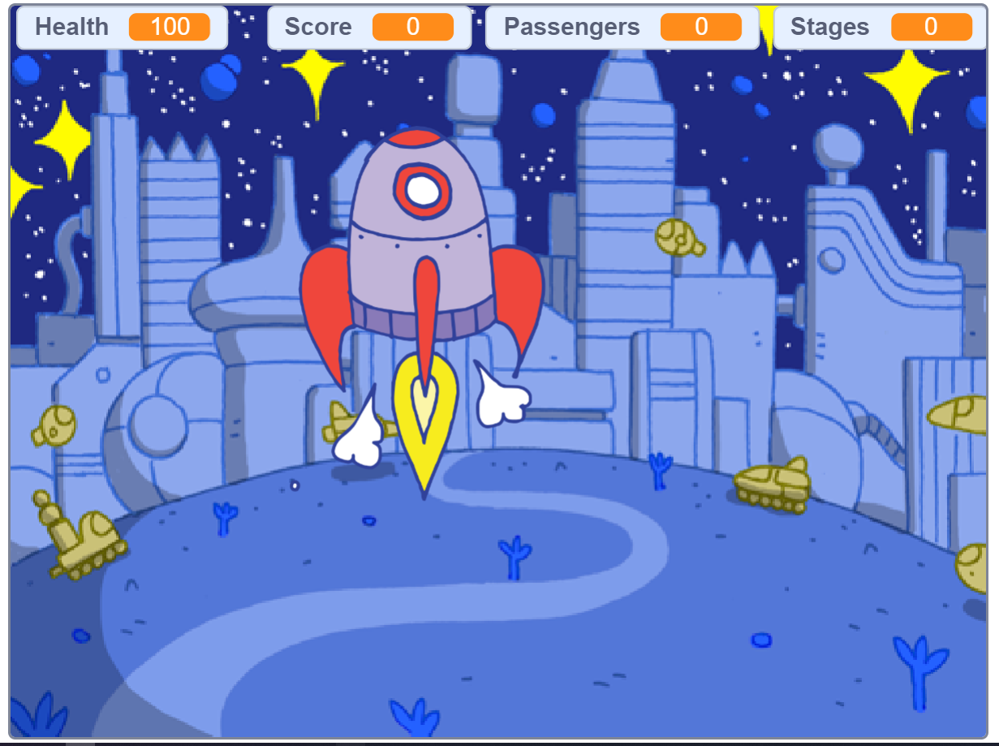
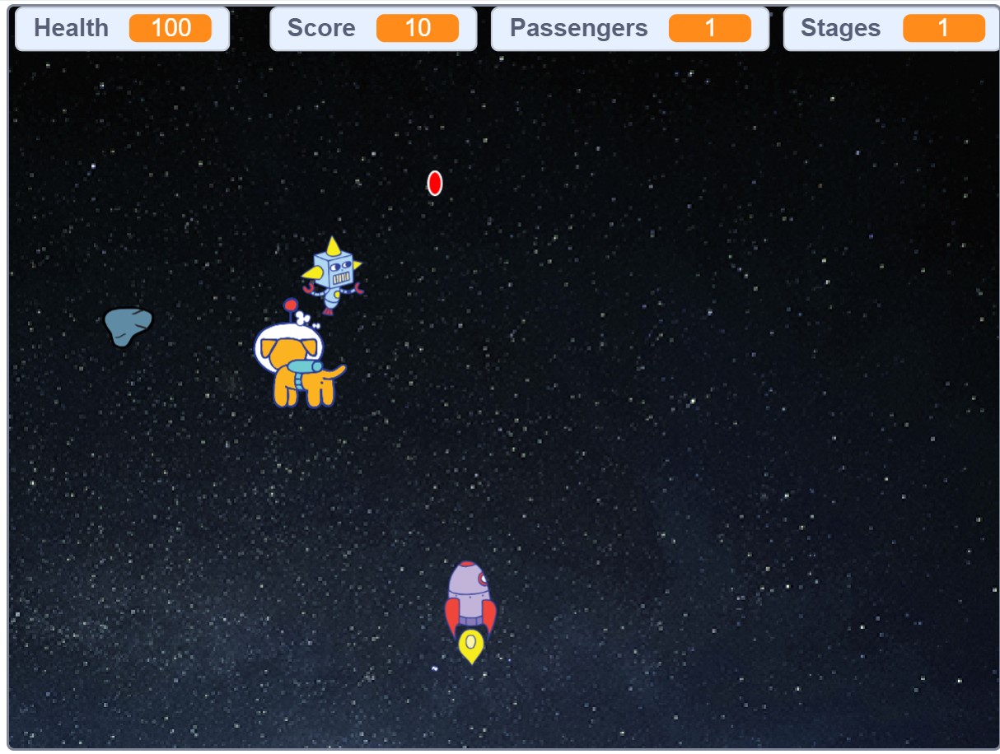
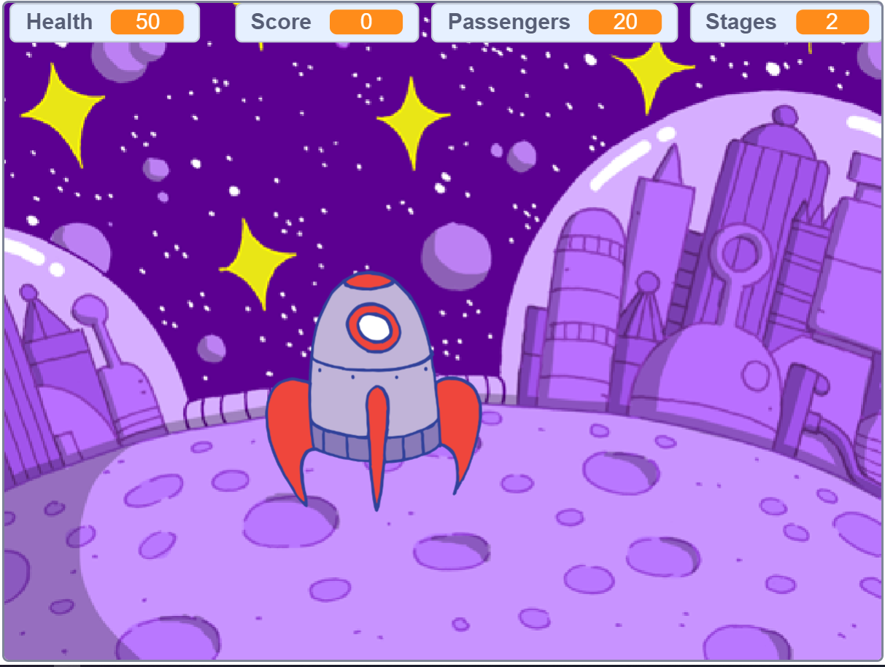

# CS50x Problem Set 0: Scratch - Space Rescue

## Overview
**Space Rescue** is my submission for **CS50x Problem Set 0: Scratch**. It's an exciting space adventure game where you pilot a rocket from your home planet to rescue 20 stranded passengers from a damaged spaceship. Dodge enemy robots and asteroids, collect passengers carefully, and return them safely to a landing zone!

## 🎮 Gameplay
- **🚀 Launch**: Use **arrow keys** to control your rocket and escape the planet's **artificial gravity**.
- **🎯 Rescue**: Collect **20 passengers** floating in space (don't shoot them!).
- **⚔️ Combat**: 
  - Press **F** to fire **laser bullets** at robots and asteroids.
  - Press **D** for a **powerful laser beam**.
- **🪐 Victory**: Land smoothly on the appearing **rescue planet** to win!
- **💥 Game Over**: Crash into ground, shoot passengers, or get hit by enemies.

## Features
- **Artificial Gravity**: Realistic launch/landing physics — control thrust carefully!
- **Dynamic Enemies**: Robots and asteroids spawn randomly.
- **Scoring System**: +1 per passenger rescued, -5 for destroying passengers.
- **Smooth Controls**: Arrow keys for movement, F/D for weapons.
- **Win Condition**: Rescue 20 passengers + safe landing.

## Screenshots

## How to Play
1. Open [Space Rescue on Scratch](https://scratch.mit.edu/projects/1243348348/)
2. **Full Screen** recommended (F11).
3. Click the **green flag** to start!
4. Use **arrow keys** to fly, **F/D** to shoot.

## Development Notes
- Built entirely in **Scratch 3.0** during CS50x PSet 0.
- Implemented **custom gravity physics** using velocity and acceleration.
- **Sprite management**: Rocket, passengers (20), robots, asteroids, planet.
- **Collision detection**: Precise hitboxes for shooting/collecting.
- **Random spawning**: Enemies appear unpredictably for replayability.

## Controls
| Key | Action |
|-----|--------|
| **Space** | Control lunching/landing |
| **↑ Arrow** | Thrust Up |
| **↓ Arrow** | Thrust Down |
| **← Arrow** | Rotate Left |
| **→ Arrow** | Rotate Right |
| **F** | Laser Bullet |
| **D** | Power Beam |
| **R** | Restart |

## Challenges Overcome
- **Physics**: Simulated gravity with frame-by-frame acceleration.
- **Balance**: Made rescuing rewarding but shooting passengers costly.
- **Polish**: Added particle effects, smooth animations, and sound FX.

## Future Improvements
- More enemy types (UFOs, black holes).
- Power-ups (shields, multi-shot).
- High score saving.
- Multiplayer co-op rescue missions.

---

**CS50x PSet 0 Complete!**  
*From Scratch to AI — my CS50x coding journey begins 🚀*

