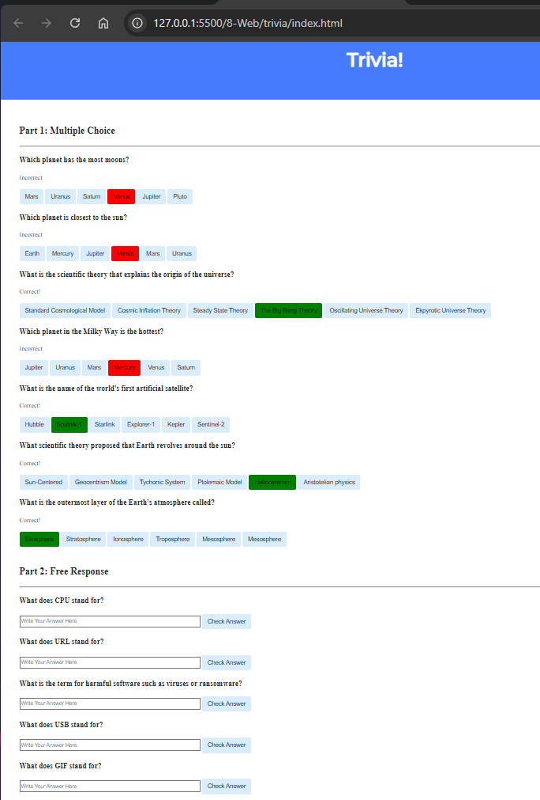
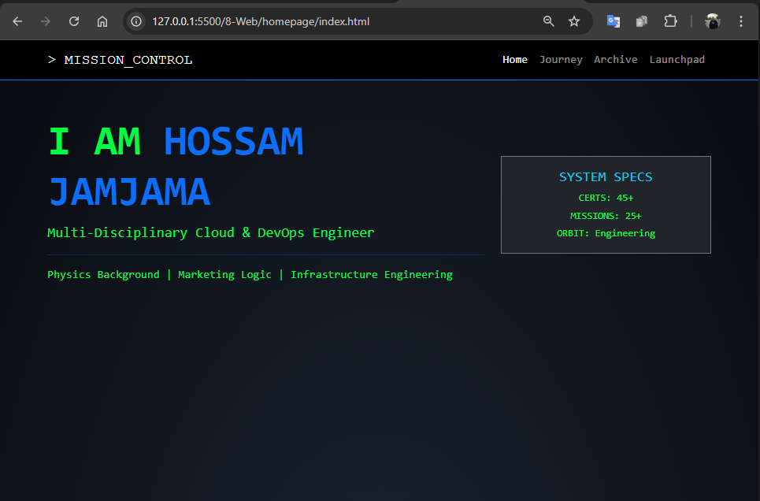
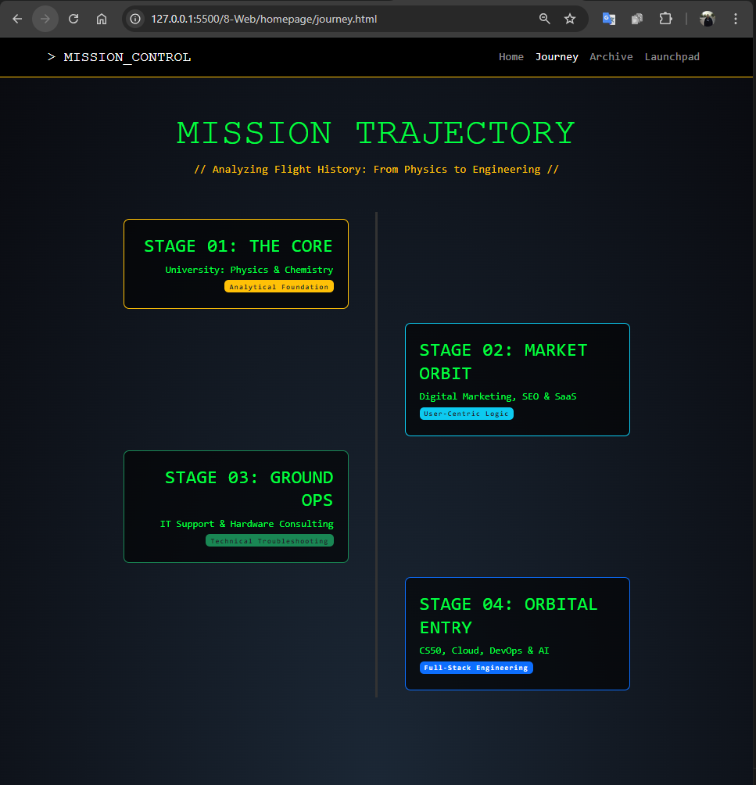
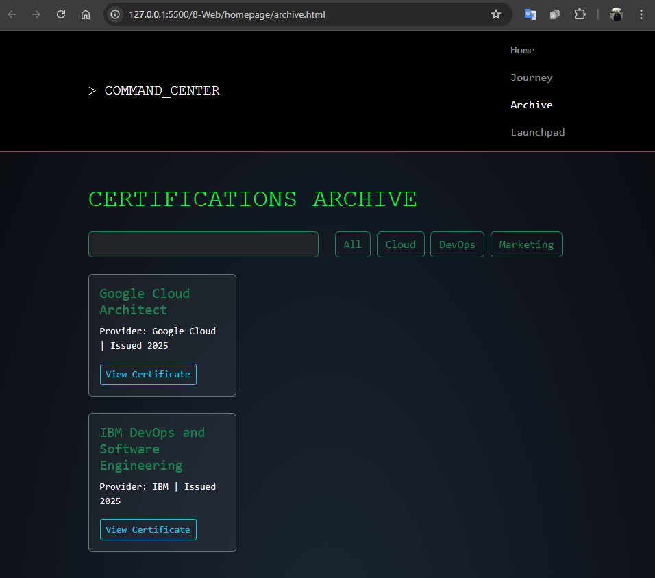
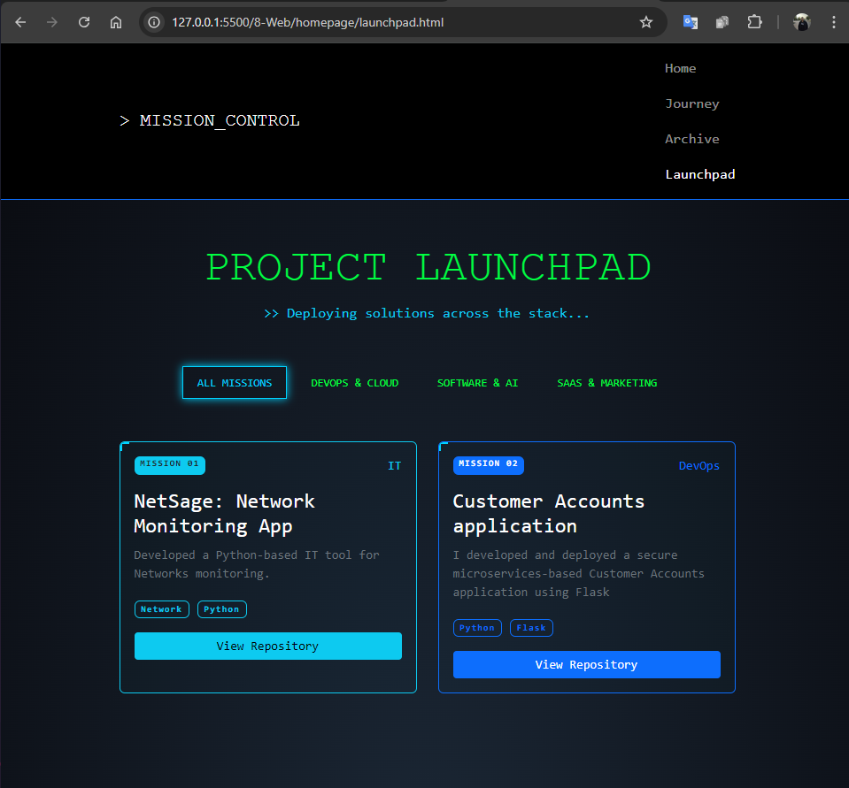

# CS50x Problem Set 8: Web Track — 100% Complete

**Status: ALL CHALLENGES CONQUERED**  
**Technologies:** HTML5 • CSS3 • JavaScript  
**Focus:** Frontend development, interactive UIs, DOM manipulation

Problem Set 8 was the **frontend finale** of CS50x's web track — we built pure client-side apps with HTML, CSS, and JS. No servers or frameworks — just raw web magic.

I completed both challenges, turning static pages into dynamic experiences.

---

### Challenges Completed

| Challenge   | Folder       | What I Built |
|-------------|--------------|-------------|
| **Trivia**  | `trivia/`    | Interactive trivia quiz with multiple-choice and free-response questions |
| **Homepage**| `homepage/`  | **"The Engineering Odyssey"** — Multi-page interactive portfolio |

---

### Trivia

**Purpose**  
Build a responsive trivia quiz that provides instant feedback using JS.

**What I Built**  
- **Part 1: Multiple-Choice** – H3 question + buttons; correct turns green/"Correct!", incorrect red/"Incorrect!"
- **Part 2: Free Response** – H3 question + input field + button; same color-coded feedback
- CSS styling for clean, modern look

**How to use**
1. Open `index.html` in a browser
2. Answer questions — click buttons or type + submit

**Demo**

**Learned:** Event listeners, DOM updates, conditional styling

---

### Homepage — "The Engineering Odyssey"

**Purpose**  
Create a personal homepage showcasing my self-learning journey.

**What I Built**  
A **space-themed portfolio** narrating my pivot from physics to engineering:
- **Home**: Mission Control with typewriter boot sequence
- **Journey**: Timeline of "rocket stages" (Physics → Marketing → IT → Engineering)
- **Archive**: Filterable grid of **45+ certifications** (search bar + category buttons)
- **Launchpad**: Showcase of **25+ projects** with modals for details

**Interactive JS Features**
- Typewriter animation on load
- Live search/filter for certs
- Modals for expanded views
- Responsive Bootstrap grid

**How to use**
1. Open `index.html` in a browser
2. Navigate pages via links
3. Interact: type in search, click modals

**Demo Screenshots**
| Page | Screenshot |
|------|------------|
| Home (Main) |  |
| Home (Boot Sequence) |  |
| Journey Timeline |  |
| Archive (Certs) |  |
| Launchpad (Projects) |  |

**Learned:** Advanced JS (modals, filters), Bootstrap, thematic CSS

---

### Final Reflections

**Problem Set 8** was the **perfect web intro**.

- **Trivia** taught interactive feedback.
- **Homepage** let me craft my story — a **self-taught engineer's manifesto**.

This wasn’t just HTML/CSS/JS.  
It was **building worlds in the browser**.

**From static pages to dynamic portfolios — I’m now a web dev.**

**Problem Set 8: Complete.**  
**CS50x Web Track: Mastered.**

**Next:** Finance app in Flask? The backend begins.