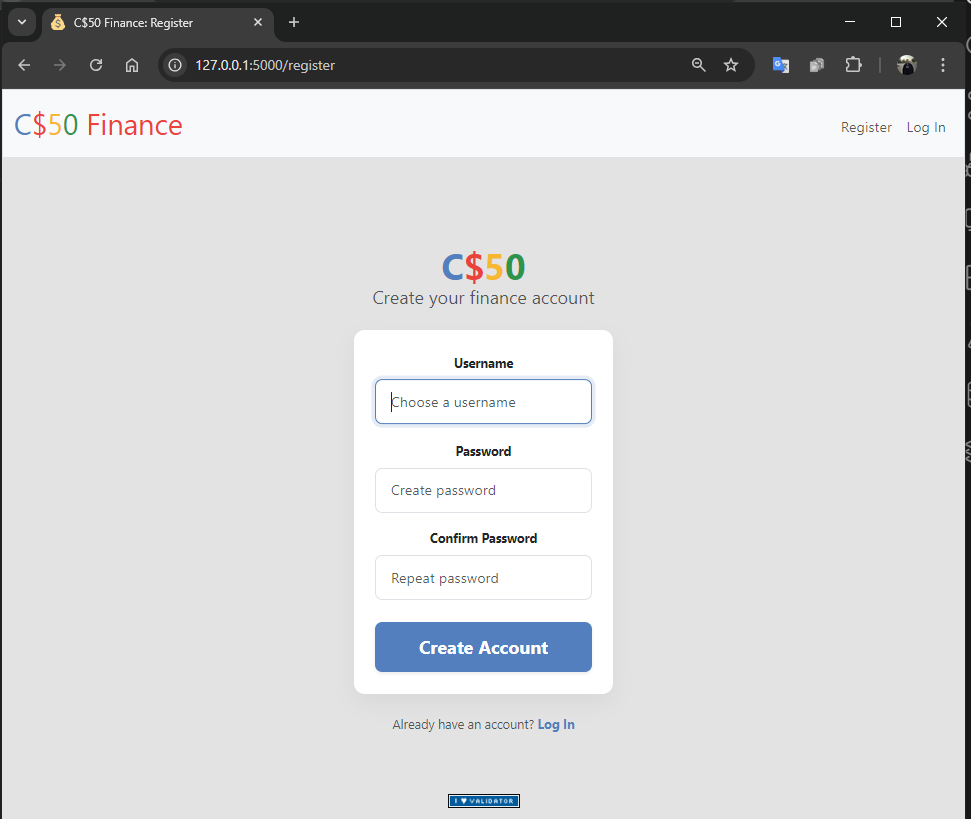
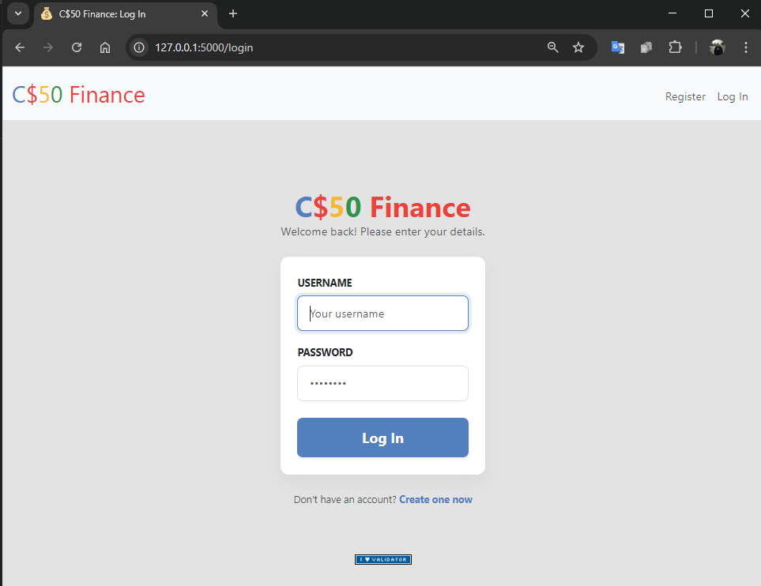
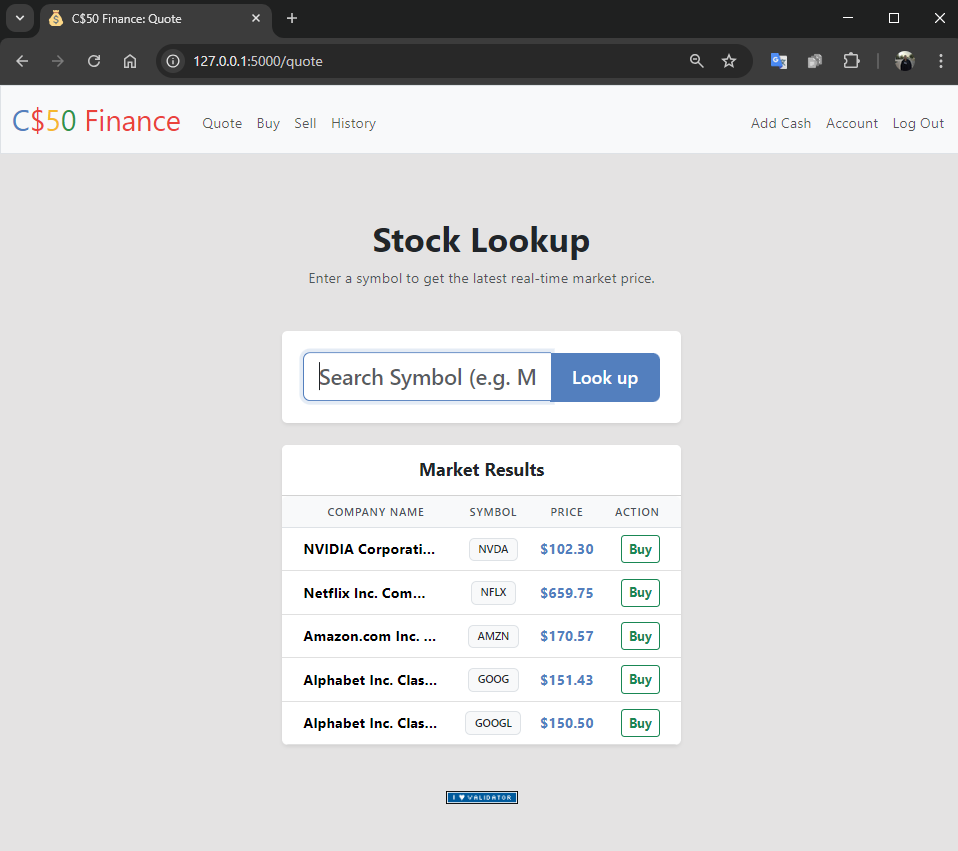
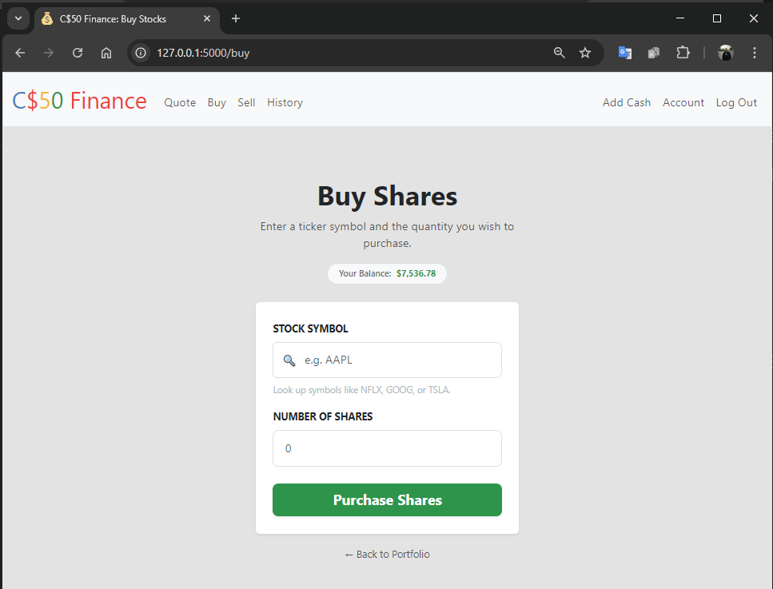
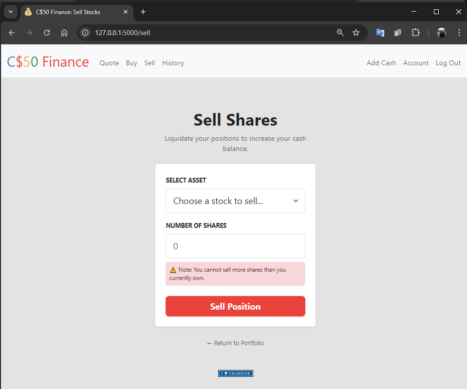
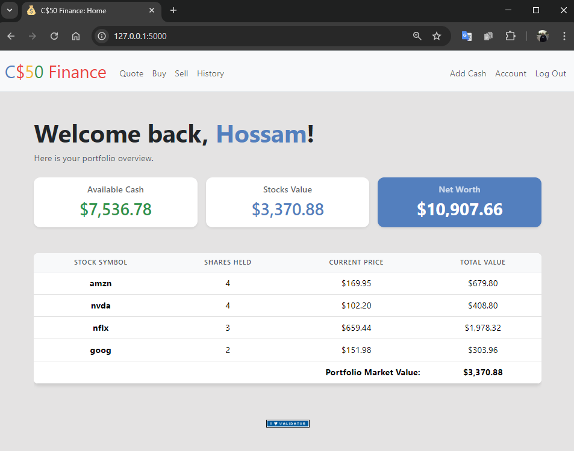
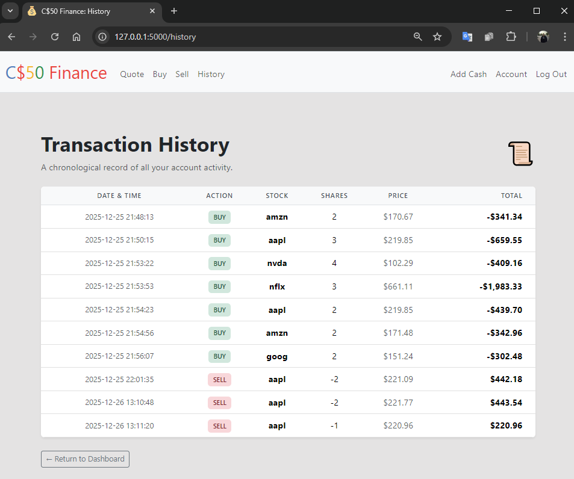
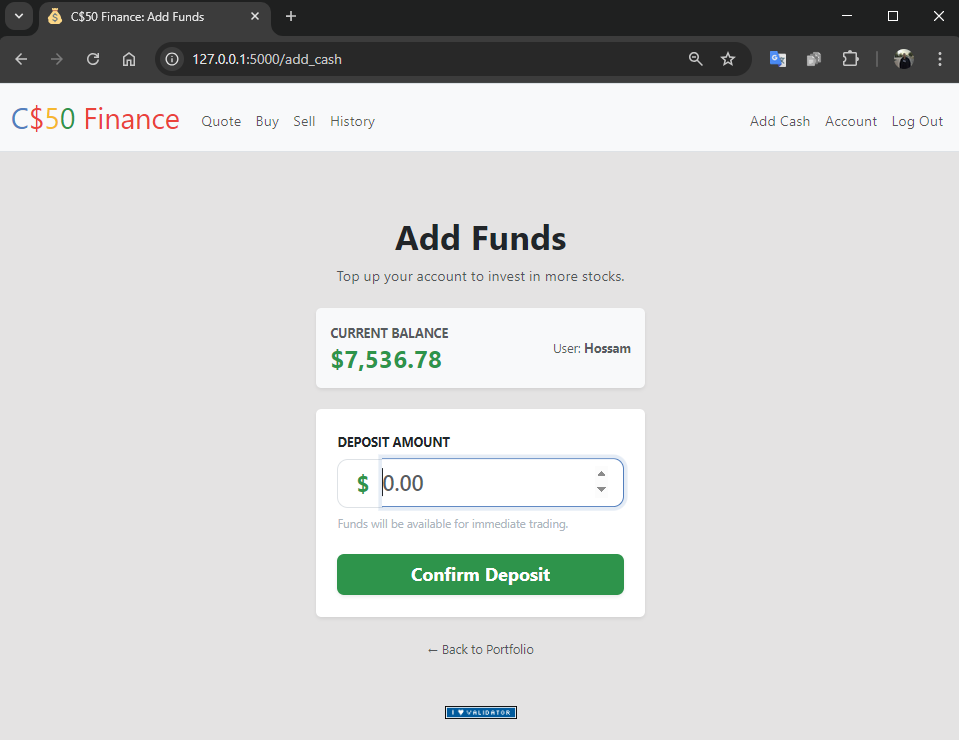
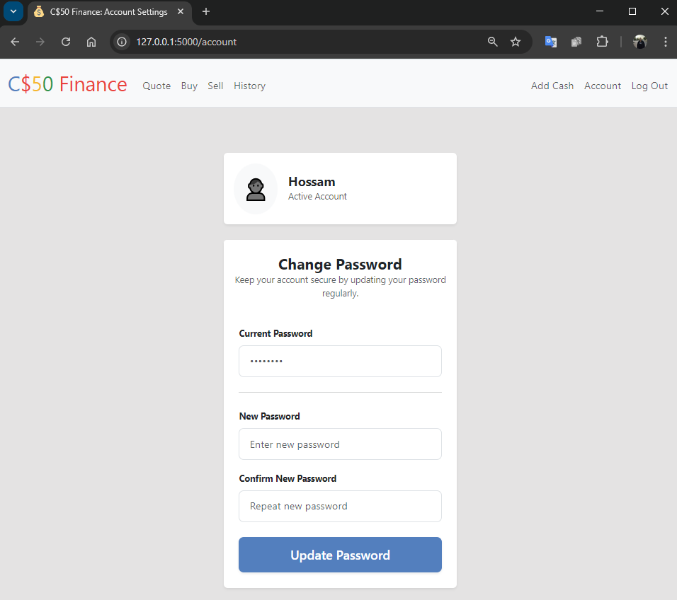

# CS50x Problem Set 9: Flask — 100% Complete

**Status: ALL CHALLENGES CONQUERED**  
**Technologies:** Python • Flask • SQLite • HTML/CSS/JS • Jinja2  
**Optional Features Implemented**

Problem Set 9 was the **full-stack finale** — we built real web applications with user accounts, databases, and dynamic content using **Flask**.

I completed both challenges, including **all optional features** for extra polish and functionality.

---

### Challenges Completed

| Challenge   | Folder       | What I Built |
|-------------|--------------|-------------|
| **Birthdays** | `birthdays/` | Birthday tracker with add/edit/delete |
| **Finance**   | `finance/`   | Full stock trading simulator (C$50 Finance) |

---

### Birthdays


**Purpose**  
A simple but powerful web app to store and manage friends’ birthdays.

**Features**
- View all birthdays in a clean table
- Add new birthdays (name, month, day)
- **Edit** existing entries
- **Delete** unwanted entries
- Persistent storage in SQLite (`birthdays.db`)

**How to use**
```bash
cd birthdays
flask run
```
→ Open browser → Add, edit, or delete birthdays

**Optional Features Added**
- Edit button with pre-filled form
- Delete confirmation + button

**Learned:** Flask forms, POST/GET routing, SQLite CRUD, Jinja loops

---

### C$50 Finance — The Grand Finale

**Purpose**  
A complete stock trading web app where users can register, buy/sell stocks, view portfolio, and track transaction history — using real stock prices.

**Features**

- User registration & login (hashed passwords)




- Quote lookup (real stock prices)



- Buy/sell shares with cash balance




- Portfolio table with current values



- Transaction history



- **Add cash** feature



- **Change password** feature



**Database Tables**
- `users` – id, username, hash, cash
- `history` – user_id, symbol, shares, price, timestamp

**How to use**
```bash
cd finance
flask run
```
→ Register → Log in → Quote, buy, sell, view history

**Optional Features Added**
- **Add additional cash** (admin-like top-up)
- **Change password** functionality

**Sample Flow**
1. Register → Get $10,000 starting cash
2. Quote NFLX → See current price
3. Buy 10 shares → Cash deducted, portfolio updated
4. Sell shares → Cash returned
5. View history → All buys/sells logged

**Learned:** Full-stack development, session management, API integration, database design, security (password hashing)

---

### Final Reflections

**Problem Set 9** was the **perfect capstone**.

- **Birthdays** taught me clean CRUD apps
- **Finance** was a real-world application — registration, authentication, transactions, live data

I didn’t just complete the requirements.  
I added **edit/delete** in Birthdays and **password change/cash top-up** in Finance — because real apps need them.

This wasn’t just Flask.  
This was **building products**.

**From `hello, world` in Week 0 to a full stock trading platform — in one year.**

**Problem Set 9: Complete.**  
**CS50x: Officially Complete.**

**Next is Final Project.**

I started with no coding experience.  
Now I build web apps that handle users, money, and data.

**CS50 didn’t just teach me to code.**  
**It launched my future.**

Thank you, CS50.
